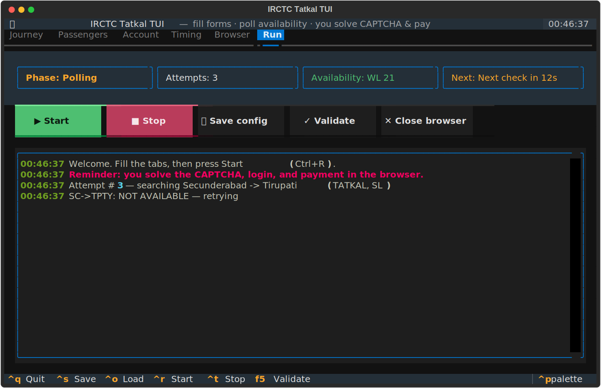
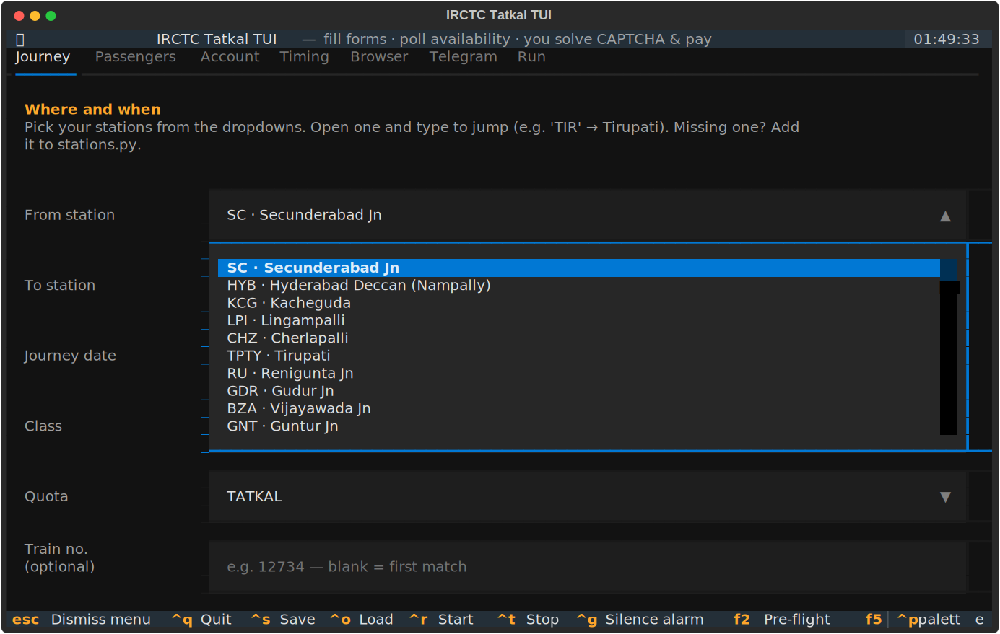
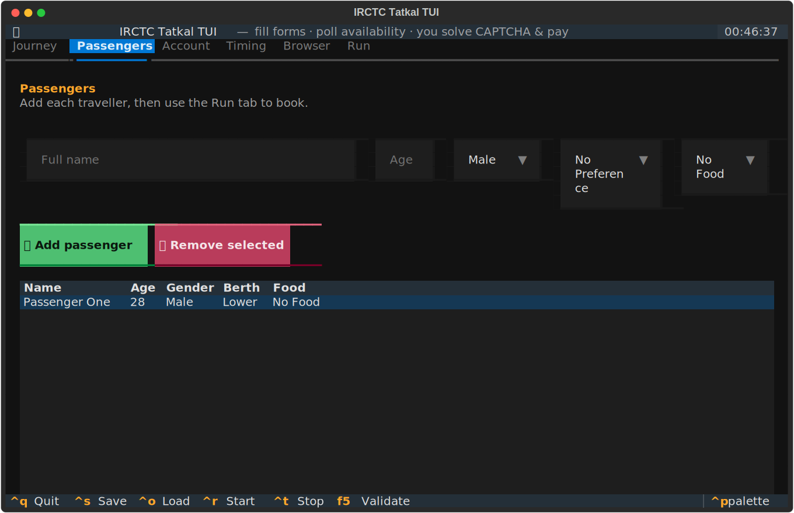
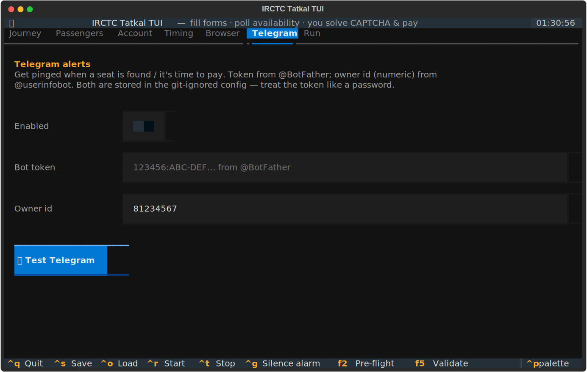

# 🚆 IRCTC Tatkal TUI

> A terminal UI that automates the tedious parts of booking an
> [IRCTC](https://www.irctc.co.in/eticket/train-search) train ticket — station
> entry, journey date, quota/class, passenger details, and **Tatkal availability
> polling on a custom interval** — while leaving every step that must stay human
> (the **CAPTCHA**, the **login**, and the **payment**) to you.

<p align="center">
  
  
  
  
</p>

<p align="center"></p>

---

## Why this exists

Tatkal tickets sell out in seconds. The bottleneck isn't the booking itself —
it's typing the same journey and passenger details fast enough, and refreshing
availability at the right moment. This tool keeps all of that pre-entered and
ready, polls availability on an interval **you** choose, and drives a **headed**
browser right up to the CAPTCHA so you only do the parts a human must.

## ⚠️ Read this first — what it does *not* do

This is a form-filler and availability watcher, **not** a CAPTCHA solver.

- ❌ It never solves CAPTCHAs or bypasses bot detection — it **stops and waits**
  for you to do them in the browser.
- ❌ It never enters payment details and never submits a payment — **you** pay.
- ✅ It fills the search + passenger forms and polls availability.

Automated booking may violate [IRCTC's terms of service](https://www.irctc.co.in/).
You are responsible for how you use this. Keep your polling interval reasonable —
hammering IRCTC is abusive and will get you blocked. Use it for **your own**
bookings.

## Features

- **Everything is enterable** from the TUI — from/to stations, date, class,
  quota, target train, an unlimited passenger list, IRCTC username, poll
  interval, a scheduled start time, retry limits, browser engine, and more.
- **Headed browser** so you watch every step and can take over instantly.
- **Custom availability polling** — check every *X* seconds (with jitter).
- **Scheduled start** — arm it before 10:00/11:00 AM and let it fire the moment
  the Tatkal window opens.
- **Human-in-the-loop by design** — it pauses for you at login, CAPTCHA, and
  payment. The **headed browser stays open** at the payment screen so you finish
  the payment yourself.
- **🔔 Completion alarm** — when a seat is found / the payment hand-off is
  reached, it **rings a looping alarm until you silence it**, so you can walk
  away and be called back. Bring your own `.wav`/`.mp3` or use the built-in tune.
- **🔎 Live selector verifier** — a **Pre-flight** button (and `irctc-recon` CLI)
  inspects the real IRCTC DOM and shows exactly which selectors still match, so
  you can confirm everything's wired the morning of your booking.
- **📲 Two-way Telegram bot** — get pinged when a seat is found or it's time to
  pay, **and control the run from your phone**: reply `status`, `run`, `stop`,
  `silence`, or `shot` (sends a live browser screenshot) to the bot.
- **⬇️ Station dropdowns** — pick From/To from a curated list (type to jump); no
  more mistyped station codes.
- **Config saved to disk** (git-ignored) so you never re-type your journey.
- **All selectors centralized** in one file — trivial to fix when IRCTC changes
  its DOM.

## Install

Requires **Python 3.10+**.

```bash
git clone https://github.com/nickthelegend/irctc-tatkal-tui.git
cd irctc-tatkal-tui

# Option A — uv (recommended)
uv venv && source .venv/bin/activate
uv pip install -e .

# Option B — pip
python -m venv .venv && source .venv/bin/activate
pip install -e .

# One-time: download the browser Playwright drives
playwright install chromium
```

## Quick start

```bash
irctc-tui                 # launches the TUI, reads/writes ./config.json
irctc-tui -c ~/trip.json  # use a specific config file
python -m irctc_tui       # equivalent module form
```

1. Fill the **Journey**, **Passengers**, **Account**, **Timing**, and **Browser**
   tabs.
2. Press **F5** to validate, **Ctrl+S** to save.
3. Go to the **Run** tab and press **▶ Start** (or **Ctrl+R**).
4. Watch the browser. When it opens the login modal, **you** solve the CAPTCHA
   and sign in. When a seat is available it fills passenger details and **starts
   the alarm**; at the payment/CAPTCHA step it hands the browser back to **you**
   (the alarm keeps ringing until you press **Ctrl+G** / **🔕 Silence**).

### Keyboard shortcuts

| Key | Action |
| --- | --- |
| `Ctrl+S` | Save config |
| `Ctrl+O` | Reload config from disk |
| `F5` | Validate config |
| `Ctrl+R` | Start booking run |
| `Ctrl+T` | Stop (graceful) |
| `Ctrl+G` | Silence the alarm |
| `F2` | Pre-flight selector check |
| `Ctrl+Q` | Quit (closes the browser) |

## The tabs

| Tab | What you set |
| --- | --- |
| **Journey** | From/To station **dropdowns** (type to jump), journey date (DD-MM-YYYY), class, quota, optional target train number. |
| **Passengers** | Add/remove travellers — name, age, gender, berth & food preference. |
| **Account** | IRCTC username, optional password, auto-login and session-reuse toggles. |
| **Timing** | Poll interval, jitter, scheduled start time, max attempts, retry-on-error. |
| **Browser** | Auto-book toggle, headed/headless, browser engine, slow-mo, screenshots, contact mobile, UPI id (shown only), **alarm-on-success toggle + custom alarm sound**. |
| **Telegram** | Enable alerts, **bot token**, **owner id**, and a **📤 Test Telegram** button. |
| **Run** | Live status (phase, attempts, availability, next-check countdown), Start/Stop, **🔎 Pre-flight**, **🔔 Test alarm / 🔕 Silence**, and a colour-coded event log. |

<p align="center">
  
  
</p>

## How the booking flow works

```
launch headed browser
        │
        ▼
open irctc.co.in/nget/train-search
        │
        ▼
(optional) open login  ──►  ⏸  YOU solve the CAPTCHA + press SIGN IN
        │
        ▼
wait until start time (if set)      e.g. hold until 11:00:00
        │
        ▼
┌─────────────────────────────┐
│  POLL LOOP (every X seconds) │
│  fill search → read status   │◄─── not available? sleep, retry
└──────────────┬──────────────┘
        │ available / RAC   ──►  🔔 ALARM + 📲 Telegram alert (alarm rings until
        ▼                        you silence it)
click Book Now → fill all passengers
        │
        ▼
reach review / payment  ──►  ⏸  YOU solve the CAPTCHA + pay   (+📲 "come pay")
                               (headed browser stays open — the alarm keeps
                                ringing so you know to come pay)
```

The tool **stops at every ⏸**. It never touches the CAPTCHA or the payment, and
the browser is left open for you to finish.

## Configuration reference

The TUI reads and writes `./config.json`. You can also hand-edit it. See
[`config.example.json`](config.example.json). Shape:

```jsonc
{
  "account":  { "username": "", "password": "", "auto_login": true, "reuse_session": false },
  "journey":  { "from_station": "SC", "to_station": "TPTY", "journey_date": "24-07-2026",
                "travel_class": "SL", "quota": "TATKAL", "train_number": "", "boarding_station": "" },
  "passengers": [ { "name": "", "age": 0, "gender": "Male",
                    "berth_preference": "No Preference", "food_preference": "No Food",
                    "nationality": "India", "senior_citizen": false } ],
  "timing":   { "check_interval_seconds": 15.0, "jitter_seconds": 3.0, "start_time": "",
                "max_attempts": 0, "retry_on_error": true },
  "behavior": { "auto_book_when_available": true, "stop_before_payment": true,
                "upi_id": "", "contact_mobile": "", "save_screenshots": true,
                "alarm_on_success": true, "alarm_sound_path": "",
                "headed": true, "slow_mo_ms": 0, "browser": "chromium" },
  "telegram": { "enabled": false, "bot_token": "", "owner_id": "" }
}
```

| Field | Meaning |
| --- | --- |
| `journey.from_station` / `to_station` | Station **code** (picked from the dropdown), typed into IRCTC's autocomplete — `SC`=Secunderabad, `HYB`=Hyderabad Deccan, `KCG`=Kacheguda, `TPTY`=Tirupati. Add more in [`stations.py`](src/irctc_tui/stations.py). |
| `journey.journey_date` | `DD-MM-YYYY`. |
| `journey.quota` | `TATKAL`, `PREMIUM TATKAL`, `GENERAL`, … |
| `journey.train_number` | Lock onto one train (e.g. `12734`). Blank = first train with the class available. |
| `timing.check_interval_seconds` | How often to re-check availability. **Keep ≥ a few seconds.** |
| `timing.jitter_seconds` | Random 0–N s added to each interval so requests aren't perfectly periodic. |
| `timing.start_time` | `HH:MM:SS` to hold the first search until. Blank = start now. |
| `behavior.auto_book_when_available` | When free, proceed into passenger entry automatically. |
| `behavior.alarm_on_success` | Ring a looping alarm when a seat is found / payment hand-off is reached. |
| `behavior.alarm_sound_path` | Path to your own `.wav`/`.mp3`. Blank = a built-in tune synthesised on first use. |
| `behavior.headed` | Headed browser (default). Headless is offered for dry-runs but IRCTC blocks it. |
| `telegram.enabled` | Turn on Telegram alerts to your chat. |
| `telegram.bot_token` | Bot token from **@BotFather**. Secret — stored in the git-ignored config. |
| `telegram.owner_id` | Your numeric chat id (from **@userinfobot**). |

> Your `config.json` may contain your IRCTC username/password in plaintext. It is
> **git-ignored**. Leave `password` blank to type it in the browser instead.

## Tatkal timing tips

- Tatkal booking opens **one day before** the journey date:
  **10:00 AM for AC classes** (2A/3A/CC/…), **11:00 AM for non-AC** (SL/2S).
- Set `timing.start_time` to just before that (e.g. `10:59:57`) so the tool is
  logged in and armed, and fires the first search on the dot.
- Have **auto-login on**, be signed in early (solve the login CAPTCHA in advance),
  and let the poll loop hit *Search → Book Now* the instant the window opens.

## 🔔 The completion alarm

When a seat becomes bookable (and again at the payment hand-off), the tool starts
a **looping alarm that rings until you silence it** — press **🔕 Silence** on the
Run tab or **Ctrl+G**. Walk away and let it call you back.

- **Bring your own song:** set `behavior.alarm_sound_path` (or the *Alarm sound
  file* field) to any `.wav`/`.mp3`. Leave it blank for a built-in chime that is
  synthesised on first use into `~/.cache/irctc-tui/alarm.wav` (no copyrighted
  audio is bundled).
- **Test it first:** press **🔔 Test alarm** on the Run tab to make sure your
  speakers work — then silence it.
- Playback uses your OS player (`afplay` on macOS, `paplay`/`aplay`/`ffplay`/
  `mpg123` on Linux, `winsound` on Windows), falling back to the terminal bell.

## 🔎 Pre-flight check & selector verifier

IRCTC's DOM shifts between releases, so verify before you rely on it — two ways:

**In the app:** press **🔎 Pre-flight** on the Run tab (or **F2**). It opens the
live search page in the browser and streams a ✓/✗ line per selector group into
the Run log, ending with `Pre-flight done: N/M selector groups matched`. Run it
the morning of your booking to confirm everything's wired — without leaving the TUI.

**From the CLI:** `irctc-recon` also lists every control it discovers:

```bash
irctc-recon                 # headless; verify selectors + list controls
irctc-recon --headed        # watch it in a real Chromium window
irctc-recon --json dom.json # also dump the discovered controls to JSON
python -m irctc_tui.recon   # equivalent module form
```

Read the `✗` / `⚠ NONE matched` lines, then update that group in
[`src/irctc_tui/selectors.py`](src/irctc_tui/selectors.py). Run it from a network
that can reach IRCTC (some sandboxes/proxies/VPNs block it).

## 📲 Telegram alerts

Get pinged on your phone the instant a seat is found or it's time to pay — handy
when the alarm is at your desk but you aren't.

1. Message **[@BotFather](https://t.me/BotFather)** → `/newbot` → copy the **bot
   token**.
2. Message **[@userinfobot](https://t.me/userinfobot)** → copy your numeric
   **owner id** (start a chat with your new bot first so it can message you).
3. In the **Telegram** tab: turn on *Enabled*, paste the token and owner id, and
   press **📤 Test Telegram** — you should get a test message.

Alerts fire (once each) on: run start, **seat available**, **payment hand-off**,
done, stop, error, and any "action needed" moment (e.g. login required). The bot
token is stored in your **git-ignored** `config.json` — treat it like a password.

<p align="center"></p>

### Control it from your phone (two-way)

Once alerts are on, the bot also **listens for commands** — reply to it in the
chat and it acts on your run. Only messages from your `owner_id` are obeyed.

| Send | It does |
| --- | --- |
| `status` | Replies with the current phase, attempts, and login state. |
| `run` | Starts the booking run (validates config first). |
| `stop` | Stops the run gracefully. |
| `silence` | Silences the alarm. |
| `shot` | Sends a **screenshot of the live browser** back to your chat. |
| `help` | Lists the commands. (`/start` shows help too.) |

Remote control comes online when you press **📤 Test Telegram**, when a run
starts, or at launch if Telegram is already configured. It's polled every few
seconds, so commands act within moments.

## When IRCTC changes its DOM (troubleshooting)

IRCTC's Angular site changes often. If a step stops working:

1. Run `irctc-recon` (above) to see which selector groups no longer match.
2. Run with `save_screenshots` on and look in `screenshots/` to see where it got
   stuck.
3. Open [`src/irctc_tui/selectors.py`](src/irctc_tui/selectors.py) — **every**
   selector lives there as a list of fallbacks. Add or reorder candidates.
4. The browser is headed — you can always finish the step by hand and the tool
   picks up from the visible page.

Common tweaks: the station autocomplete, the journey-date calendar, and the
results/availability cells are the most version-sensitive.

## Project layout

```
src/irctc_tui/
├── app.py          # Textual TUI (tabs, widgets, run control)
├── app.tcss        # TUI stylesheet
├── automation.py   # Playwright engine: search, poll, book, hand off
├── selectors.py    # ALL IRCTC selectors + availability parsing  ← edit when DOM changes
├── recon.py        # live DOM inspector + selector verifier (irctc-recon)
├── preflight.py    # in-app pre-flight selector check (streams to the Run log)
├── alarm.py        # cross-platform looping completion alarm
├── notify.py       # Telegram alerts + two-way command polling (stdlib urllib)
├── stations.py     # curated station list for the From/To dropdowns
├── config.py       # dataclasses + JSON load/save/validate
├── events.py       # BotEvent/Phase/Level passed to the UI
└── cli.py          # entry point
tests/              # config, selectors, alarm, notify, recon, and TUI tests
```

## Development

```bash
uv pip install -e ".[dev]"
pytest            # 46 tests; TUI/notify tests need no browser or network
ruff check src/   # lint
```

Two console entry points are installed: **`irctc-tui`** (the app) and
**`irctc-recon`** (the selector verifier).

## Responsible use & disclaimer

This project is provided under the MIT license **as-is**, for personal and
educational use. It does not solve CAPTCHAs, bypass bot detection, or process
payments. Automated interaction with IRCTC may violate their terms of service —
review them and use your judgement. The authors take no responsibility for how
you use it, for blocked accounts, or for missed bookings.

## License

[MIT](LICENSE) © 2026 Nivesh Gajengi
